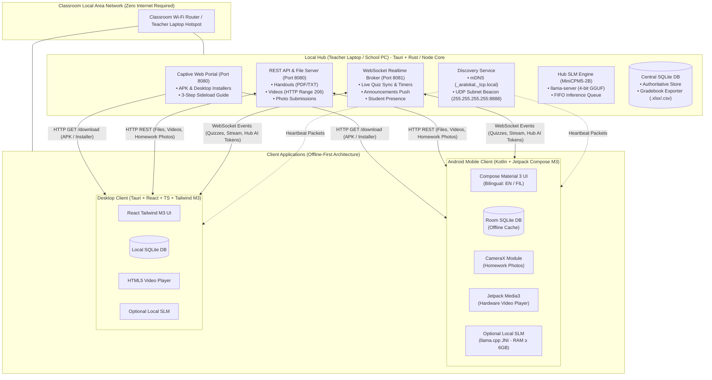
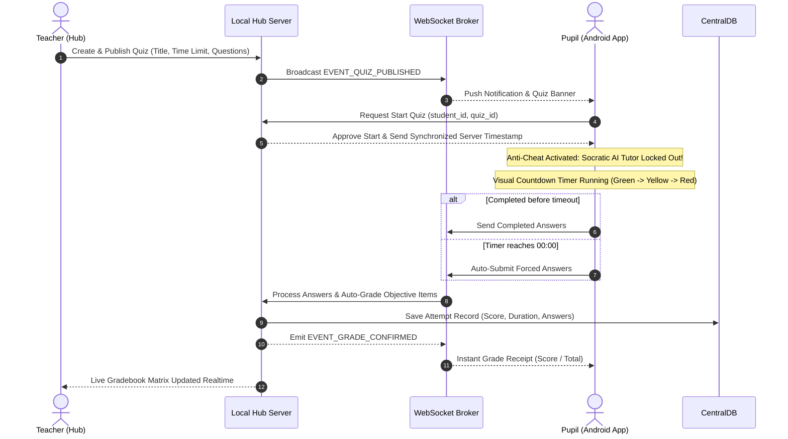
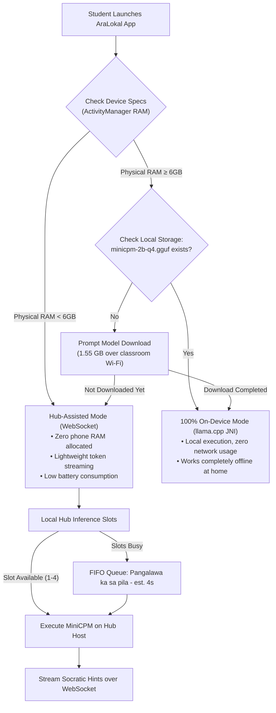
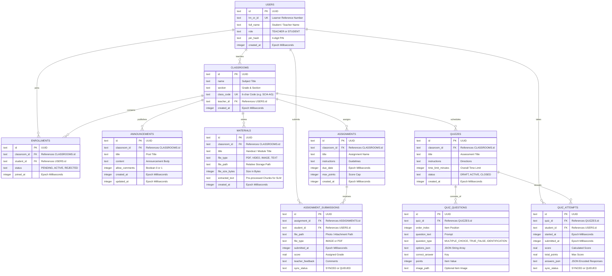
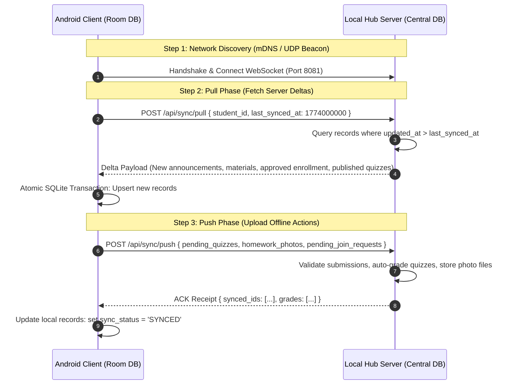

# Product Requirements Document (PRD)

**Project Title:** Offline LAN-Based Classroom Management System with Hybrid Socratic SLM Tutor and Paperless Assessment Engine 
**Working Codename:** AraLokal 
**Document Version:** 1.2.0 
**Target Release Date:** Academic Year 2026–2027 Capstone Cycle 
**Target Environment:** Philippine Public Elementary Schools (DepEd Grades 1–6), Rural Campuses, and Zero-Internet Classrooms 

---

## 1. Executive Summary & Context

### 1.1 Project Overview
AraLokal is a zero-internet, local-area-network (LAN) classroom management platform engineered as an offline alternative to Google Classroom. It pairs an offline-first learning management system (LMS) with an embedded, local Small Language Model (SLM) based on **MiniCPM5-2B**.

The system operates across three interconnected applications:
1. **Local Hub (Server):** A standalone desktop application (Tauri + Rust/Node) hosted on a teacher’s laptop or school PC. It acts as the local source of truth, hosts a captive download portal with visual onboarding, brokers WebSocket events, manages file submissions, and runs an SLM inference server.
2. **Mobile Client (Android):** A native Android application (Kotlin + Jetpack Compose + Material 3) running offline-first on students' mobile devices with local Room (SQLite) storage, camera homework capture, bilingual localization, and optional on-device SLM execution.
3. **Desktop Client:** A cross-platform desktop application (Tauri + React + TypeScript + Tailwind) for school computer laboratories or teacher desktop management.

### 1.2 The Philippine Context & Research Motivation
* **High Smartphone Penetration vs. Absent Connectivity:** IDC and Canalys (2024) market reports demonstrate that Transsion Holdings (Infinix, TECNO, itel) dominates the Philippine smartphone market with a 37.3% share, followed by realme (13.3%) and Xiaomi. More than 50% of shipped phones are entry-level devices under $100 (~₱3,500–₱5,500). Filipino elementary pupils commonly have physical access to these household smartphones. However, persistent mobile data costs, lack of campus broadband, and rural network dead-zones render cloud-based LMS solutions (Google Classroom, MS Teams, Canvas) unusable.
* **DepEd Teacher Financial & Logistical Burden:** Public elementary teachers routinely shoulder out-of-pocket expenses for paper and printing to produce daily worksheets, weekly formative tests, and quarterly summative assessments. A paperless, offline LAN assessment engine removes recurring reproduction expenses.
* **Hardware Realities (The RAM Bottleneck):** The vast majority of student devices feature 3GB or 4GB of physical RAM. Because Android and vendor UI skins occupy 1.8GB–2.2GB, usable app headroom is strictly ~800MB–1.2GB. Running an unoptimized 2B model on-device triggers out-of-memory (LMK/OOM) crashes. AraLokal solves this via an adaptive hybrid architecture: the Local Hub executes the model for low-spec phones, while capable devices (≥6GB RAM) run 100% on-device.
* **Pedagogical Alignment:** Mainstream commercial LLMs provide answers outright, eroding critical thinking. AraLokal’s embedded SLM is engineered with strict Socratic system prompts, guiding elementary pupils step-by-step using teacher-provided materials without divulging final answers.

---

## 2. Core Personas & Use Cases

### 2.1 Primary Personas
* **Teacher Maria (Grade 4 Science & Math Teacher):**
 * Operates a modest Windows/Linux laptop.
 * Connects her laptop to a standard TP-Link Wi-Fi router or activates her laptop’s Wi-Fi hotspot (no internet WAN required).
 * Creates class sections, distributes digitized modules and educational videos, conducts paperless quizzes, reviews homework photo submissions, and exports DepEd-compliant grade sheets directly to a USB flash drive.
* **Pupil Juan (Grade 4 Pupil):**
 * Uses a family-owned budget Android phone (e.g., realme Note 50 or Infinix Smart 8 with 3GB/4GB RAM).
 * Connects to the classroom Wi-Fi, downloads the app directly from the Hub's web portal following a 3-step visual guide, joins with a Class Code, downloads lesson materials and videos, takes timed paperless quizzes, snaps photos of handwritten math homework to submit, and gets bilingual Socratic guidance from the AI tutor.
 * Takes his phone home where the app remains completely functional in disconnected mode.

---

## 3. System Architecture & Network Topology



### 3.1 Network Discovery & Connection Lifecycle
1. **Zero-Configuration Discovery:**
 * **mDNS / Zeroconf:** Local Hub advertises service as `_aralokal._tcp.local` on port 8080.
 * **UDP Broadcast Beacon:** Hub broadcasts a lightweight JSON beacon every 3 seconds to subnet broadcast address (`255.255.255.255:8888`):
 ```json
 {"app": "aralokal", "version": "1.2.0", "name": "Grade 4 - Room 102", "ip": "192.168.1.50", "http_port": 8080, "ws_port": 8081}
 ```
 * **Manual IP Fallback:** Client provides a manual connection field where pupils/teachers can enter the host IP shown on the Hub GUI (e.g., `192.168.1.50:8080`).
2. **Captive Distribution Portal with Visual Sideloading Guide (HTTP):**
 * Hub serves a responsive HTML landing page at `http://<hub-ip>:8080/download`.
 * Hosts:
 * `AraLokal-Student.apk` (Android client)
 * `AraLokal-Desktop-Setup.exe` / `.deb` (Desktop client)
 * Quantized model weight bundles (`minicpm-2b-q4.gguf`) for optional on-device AI.
 * **3-Step Visual Installation Guide on Web Portal:**
 * *Step 1:* Tap the large **"Download AraLokal (Android)"** button.
 * *Step 2:* When prompted by Android browser, tap **Settings** Toggle on **"Allow from this source"**.
 * *Step 3:* Tap **Install** Open AraLokal and enter your Name & Student ID.
3. **Data Communication Protocols:**
 * **HTTP/1.1 REST (Port 8080):** Large binary transfers (APKs, PDF handouts, MP4 video streams, student homework photo submissions) with HTTP Byte-Range support (`Range: bytes=X-`).
 * **WebSocket (Port 8081):** Real-time bidirectional event bus (announcements push, live quiz synchronization, automated timeout enforcement, instant grade delivery, and Hub-assisted SLM token streaming).

---

## 4. Functional Specifications

### 4.1 Module 1: Offline Identity & Class Enrollment Gate
* **FR-1.1 Self-Registration:** Students register locally upon first connecting to the Hub by providing: Full Name, Learner Reference Number (LRN) / Student ID, and a 4-digit PIN.
* **FR-1.2 Class Code Entry:** Pupils join a subject by entering a 6-character alphanumeric code generated by the teacher (e.g., `SCI4-AG`).
* **FR-1.3 Teacher Verification Gate:**
 * Entering a valid code places the student in a `PENDING_APPROVAL` queue.
 * The teacher's interface alerts: *"Juan Dela Cruz (LRN: 123456789) wants to join Grade 4 - Science."*
 * Teacher has one-click actions: **Accept** or **Decline**.
 * Once approved, the class key is sent via WebSocket to unlock class access on the pupil's app.

### 4.2 Module 2: Stream & Announcements
* **FR-2.1 Teacher Broadcasts:** Teachers post text announcements, agenda items, or urgent notices.
* **FR-2.2 Comment Moderation:** Teachers can enable or disable student commenting per post to prevent distractions.
* **FR-2.3 Offline Persistence:** All stream items are cached in the client’s local SQLite database for viewing outside the school network.

### 4.3 Module 3: Classwork, Handouts, Videos & Homework Submissions
* **FR-3.1 Document Uploads:** Teachers can upload PDFs, text documents, and images.
* **FR-3.2 Automated Text Chunking (Hub Side):** Upon document upload, the Hub automatically extracts plain text and splits it into structured chunks. This metadata is bundled with the document so student phones avoid heavy PDF parsing.
* **FR-3.3 Video Upload & Byte-Range Streaming:**
 * Teachers can upload educational video files (MP4 / WebM encoded in H.264, max file size capped at 250MB).
 * Hub serves videos via HTTP `206 Partial Content`.
 * Pupils can stream directly over Wi-Fi with instant seeking or tap **Save for Home Study** to download to local storage.
 * Android client uses **Jetpack Media3 (ExoPlayer)** with hardware acceleration; Desktop uses HTML5 `<video>`.
* **FR-3.4 Bandwidth Rate-Limiting:** Hub enforces a per-client streaming limit (max 2.0 MB/s) to prevent classroom Wi-Fi router congestion during simultaneous video playback.
* **FR-3.5 Homework Assignments & Camera Photo Submission:**
 * Teachers can post assignments with title, instructions, due date, and maximum points.
 * **In-App Camera Capture:** Pupils can take a photo of handwritten worksheets, drawings, or math calculations directly inside the Android app (or attach an image file).
 * **Offline Queuing:** If completed at home without Wi-Fi, the photo submission is stored locally with status `QUEUED_FOR_SUBMISSION`. The moment the pupil walks into school and connects to the Hub Wi-Fi, the submission uploads automatically.
 * **Teacher Grading Interface:** Teacher reviews student photo submissions on the Hub, assigns a score, and types short encouraging feedback.

### 4.4 Module 4: Paperless Assessment Engine (Quizzes)



* **FR-4.1 Quiz Authoring:**
 * Teacher defines Title, Instructions, and a **Global Quiz Time Limit** (e.g., 20 minutes for 15 questions).
 * Supported question types:
 1. *Multiple Choice* (Single answer, up to 4 options, optional question image).
 2. *True or False*.
 3. *Identification / Short Answer* (Case-insensitive string matching with teacher keyword list).
 * Option to shuffle question order per student.
* **FR-4.2 Timed Pupil Experience:**
 * Synchronized countdown timer at the top of the screen with visual color cues (Green Yellow at 5 mins Red at 2 mins).
 * Questions are presented in clean, elementary-friendly cards with large tap targets (minimum 56dp).
* **FR-4.3 Anti-Cheating & AI Lockout:**
 * **Strict AI Lock:** While the quiz session is active, the Socratic AI tutor floating button is completely removed and locked out.
 * **Server-Side Rejection:** The Hub drops any inference calls originating from a student with an active quiz attempt.
* **FR-4.4 Auto-Submit on Timeout:** When the countdown reaches `00:00`, the test is locked and answers are immediately transmitted to the Hub.
* **FR-4.5 Disconnection Resilience:** If classroom Wi-Fi drops during an active quiz, the timer continues locally. The test completes and is saved locally with a `QUEUED_SYNC` state. As soon as the pupil reconnects to the Hub, the test submits automatically with the recorded finish timestamp.
* **FR-4.6 Instant Auto-Grading:** Objective questions are graded instantaneously upon receipt by the Hub. Teacher can configure whether pupils see their score immediately or only after the teacher closes the assessment.

### 4.5 Module 5: DepEd Class Record & Grading Sheet Export
* **FR-5.1 Gradebook Dashboard:** Teachers can view a consolidated spreadsheet-like matrix of all students, their quiz scores, and homework grades.
* **FR-5.2 One-Click DepEd Export:**
 * Exports formatted **Excel (.xlsx) and CSV** files matching the Department of Education (DepEd) Class Record layout (Written Works, Performance Tasks, Quarterly Assessment).
 * Direct export to plugged-in **USB Flash Drives** from the Hub desktop application for easy transfer to school computers.

---

## 5. Bilingual Socratic AI Tutor System (AraLokal AI)

### 5.1 Model Specifications
* **Target Model:** **MiniCPM5-2B (Int4 Quantized / Q4_K_M GGUF)**
* **Parameter Count:** ~2.5 Billion
* **Quantized File Size:** ~1.55 GB
* **Active RAM Consumption:** ~2.2 GB (weights + KV cache + context buffer)
* **Context Window:** 2,048 tokens

### 5.2 Adaptive Hybrid Execution Logic



### 5.3 Bilingual Localization & Persona Design
* **Interface Language:** Toggle between **English** and **Filipino** in Settings.
* **Socratic Persona:** "AraLokal AI", a friendly, patient, and encouraging guide adapted for Filipino elementary pupils (Grades 1 to 6).
* **Language Agility:** AraLokal AI understands and responds in the student's selected language (English or natural conversational Filipino / Taglish standard in DepEd classrooms).
* **Interaction Trigger:** Located inside the Material Viewer as a floating button: **"Magtanong kay AraLokal AI" / "Ask AraLokal AI"**.
* **Grounding:** The prompt binds the pre-extracted text of the active lesson document.

* **Bilingual System Prompt Template:**
 ```text
 You are "AraLokal AI", a friendly and patient Socratic learning guide for Filipino elementary pupils (Grades 1 to 6).
 Your objective is to guide the student to discover answers independently.

 LANGUAGE INSTRUCTION:
 - Respond in the language used by the student (Filipino or English).
 - Use simple, encouraging words suitable for young children.

 CORE PEDAGOGICAL DIRECTIVES:
 1. Under NO circumstances should you give the direct answer, complete formula, or write homework solutions out.
 2. If the student asks: "What is the answer?" or "Ano ang sagot sa #3?", reply warmly:
 "Hindi ko maibibigay ang mismong sagot, pero tutulungan kitang tuklasin ito! Balikan natin ang binasa mo. Ano ang napansin mo sa unang bahagi?"
 3. Ground all guidance exclusively in the lesson text provided below.
 4. Provide only ONE small hint at a time, followed by a leading question that helps them take the next step.

 LESSON CONTEXT:
 \"\"\"
 {active_material_chunk}
 \"\"\"
 ```

### 5.4 Hub Inference Queue
To prevent the teacher's laptop from overloading when multiple low-RAM devices request hints simultaneously:
* Hub configures `llama-server` with **2–4 parallel inference slots**.
* Additional requests enter a **FIFO Queue**.
* The pupil’s screen displays real-time queue position: *"Nag-iisip si AraLokal AI... Pangalawa ka sa pila (~4s)"*.

---

## 6. Offline-First Data Architecture & Synchronization

### 6.1 Database Schema (Entity-Relationship Model)



### 6.2 Delta-Sync Protocol Lifecycle



* **Conflict Policy:** Server is authoritative for classroom metadata, class rosters, and official quiz score calculations. Client is authoritative for its own locally initiated drafts and homework photos.

---

## 7. Technology Stack Specifications

| Layer | Technology | Rationale |
| :--- | :--- | :--- |
| **Mobile Client** | **Native Android (Kotlin + Jetpack Compose)** | First-party Google Material Design 3; lowest RAM footprint on 3GB/4GB Transsion/realme phones; native CameraX integration for homework photos; native C++/JNI binding to `llama.cpp`. |
| **Mobile Local DB** | **Android Room (SQLite)** | Compile-time SQL validation, robust migrations, native coroutine/Flow support. |
| **Desktop Client** | **Tauri + React + TypeScript + Tailwind CSS** | Ultra-lightweight binary (~15MB installer vs ~120MB Electron), low memory overhead on school computer lab PCs; styled with Material 3 design tokens. |
| **Local Hub (Server)** | **Tauri + Rust Backend / Node.js Engine** | Native desktop management window for the teacher; high-concurrency async I/O; low idle CPU/RAM usage; direct USB flash drive export. |
| **Server Local DB** | **SQLite (via SQLx / better-sqlite3)** | Zero-config, single-file ACID storage embedded directly in the Hub. |
| **Realtime Protocol** | **WebSockets (`ws` / Rust `tokio-tungstenite`)** | Low-latency state sync, quiz countdown coordination, and token streaming. |
| **SLM Runtime** | **`llama.cpp` / `llama-server`** | Highly optimized CPU/GPU GGUF inference; supports 4-bit quantization and multi-slot continuous batching. |
| **Design System** | **Google Material Design 3 (Material You)** | Elementary-accessible components, high legibility, large touch targets (48dp+ / 56dp), dynamic color palettes, bilingual strings. |

---

## 8. Non-Functional Requirements & Guardrails

1. **Zero Internet Dependency:** The system must function 100% locally across an isolated Wi-Fi router or peer hotspot with no uplink to the global internet.
2. **Crash Prevention on Budget Hardware:** The mobile app must never allocate more than 350MB of heap RAM on 3GB/4GB devices. On-device SLM execution is strictly gated behind a 6GB physical RAM hardware check.
3. **Low-Latency Quiz Sync:** Submissions and timer events must register with the Hub within <300ms across 40 concurrent connected devices.
4. **Resumable Transfers:** Any interrupted file transfer (PDF, video, photo submission, or model bundle) must resume from the last received byte via HTTP Range headers.
5. **DepEd Data Export:** Hub must export student rosters, quiz scores, and homework grades to `.xlsx` / `.csv` formatted for standard DepEd Class Records with one click.

---

## 9. Scope Boundaries (In-Scope vs. Out-of-Scope)

### In-Scope (Capstone Target):
* Offline local Wi-Fi / hotspot operation (no internet required).
* Local Hub standalone desktop application with captive download portal and 3-step sideloading guide.
* Native Android client (Material 3) with CameraX homework photo capture.
* Desktop client (Tauri + React).
* Bilingual support (English and Filipino).
* Offline Class Code enrollment with manual teacher approval gate.
* Stream announcements with teacher comment controls.
* Downloadable materials (PDF/images) and streaming/offline educational video (MP4).
* Timed paperless quizzes with instant auto-grading for objective questions.
* MiniCPM5-2B hybrid Socratic AI tutor (Hub-assisted for low RAM, on-device for ≥6GB RAM).
* Strict AI tutor lockout during active quizzes.
* One-click DepEd Class Record export to USB flash drives.
* Delta synchronization and offline-first persistence.

### Out-of-Scope (Future Enhancements):
* Long-distance mesh networking (e.g., LoRa or Bluetooth multi-hop between classrooms).
* Integration with cloud services (Google Drive, Firebase, DepEd central cloud).
* AI auto-grading of handwritten photos or essays (all subjective homework grading remains manual for the teacher).
* Live video conferencing / video calls.

---

## 10. Capstone Evaluation & Defense Metrics

| Objective | Evaluation Metric | Target Benchmark |
| :--- | :--- | :--- |
| **Offline Independence** | Complete classroom cycle with WAN cable unplugged | 100% operational (zero failures due to lack of internet). |
| **Paperless Cost Savings** | Simulated quiz & worksheet cycle vs printed DepEd test papers | 100% reduction in paper and reproduction costs. |
| **Mobile Stability** | RAM consumption on 3GB/4GB Android devices | Heap usage < 250MB; zero OOM crashes during Hub-assisted AI mode. |
| **Inference Latency** | Time-to-First-Token (TTFT) for Socratic hints | < 2.5s on Hub queue; 8–15 tokens/s generation speed. |
| **Quiz Sync Accuracy** | Grade calculation and submission reliability | 100% accuracy in score recording across 40 simultaneous submissions. |
| **Homework Photo Upload** | Upload success rate over local Wi-Fi | 100% across 40 concurrent submissions with offline queueing. |
| **Resilience to Disconnects** | Unannounced Wi-Fi disconnection mid-quiz | 0% data loss; automatic submission upon reconnect. |
