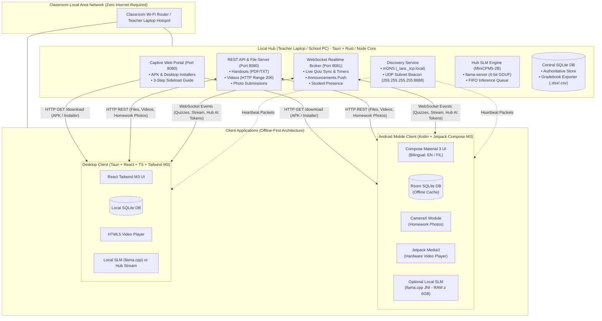
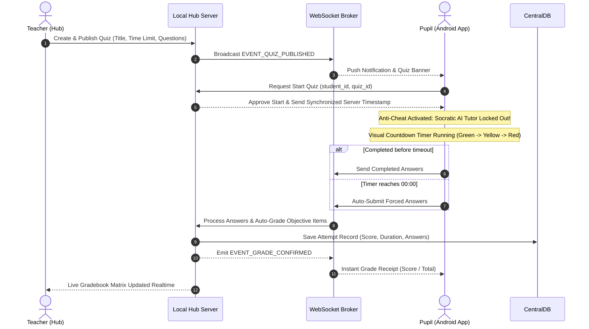
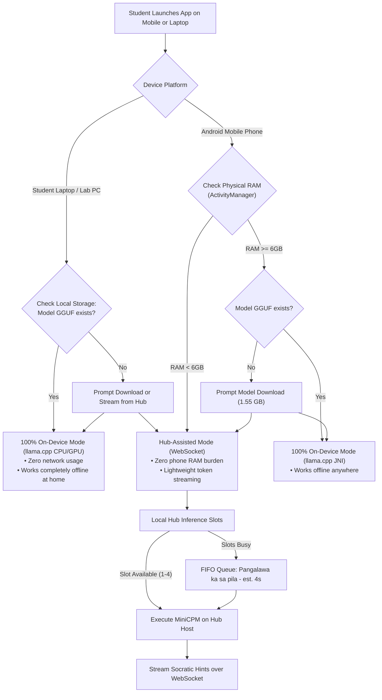

# L.A.R.A. 

> **Offline LAN-Based Classroom Management System with Hybrid Socratic SLM Tutor and Paperless Assessment Engine** 
> *Targeted for Philippine Public Elementary Schools (DepEd Grades 1–6), Rural Campuses, and Zero-Internet Classrooms.*

---

## Overview

**L.A.R.A.** is a zero-internet, local-area-network (LAN) classroom platform designed as an offline alternative to Google Classroom. It pairs an offline-first learning management system (LMS) with an embedded, local Small Language Model (SLM) based on **MiniCPM5-2B**.

Addressing the Philippine reality where **over 50% of student smartphones are entry-level 3GB/4GB RAM devices (Infinix, TECNO, itel, realme)** and public school teachers shoulder out-of-pocket photocopying expenses, L.A.R.A.:
1. Operates **100% offline** over a standard Wi-Fi router or teacher's laptop hotspot.
2. Eliminates paper test questionnaires through a synchronized, **timed paperless quiz engine** with instant auto-grading.
3. Provides a **Socratic AI Tutor (L.A.R.A. AI)** grounded in teacher-provided lesson materials that guides pupils step-by-step in English and Filipino without revealing direct answers.
4. Uses an **adaptive hybrid AI pipeline**: streams tokens over WebSocket from the Local Hub for budget 3GB/4GB phones, while capable devices (≥6GB RAM) execute 100% on-device via `llama.cpp`.

---

## System Architecture

---

## Paperless Quiz Sequence & Anti-Cheat Lockout

---

## Adaptive Hybrid SLM Execution

---

---

## Live Material Design 3 Reference

* **Live Interactive Design System:** [https://design-system-two-wheat.vercel.app](https://design-system-two-wheat.vercel.app)
* **Local Source:** 

## Full Product Requirements Document

The complete, exhaustive engineering and academic specification is documented in [PRD.md](./PRD.md).
